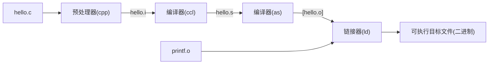

# 目录
1. [第一章 ：计算机系统漫游](#第一章-计算机系统漫游)
2. [信息就是位＋上下文](#信息就是位上下文)
3. [程序的翻译](#程序的翻译)
4. [处理器读取并解释储存在内存中的指令](#处理器读取并解释储存在内存中的指令)
5. [系统的硬件组成](#系统的硬件组成)
   - [总线](#总线)
   - [IO设备](#io设备)
   - [主存](#主存)
   - [处理器](#处理器)
6. [高速缓存](#高速缓存)
7. [进程](#进程)
8. [线程](#线程)
9. [虚拟内存](#虚拟内存)
10. [不只是硬件--重要的主题](#不只是硬件重要的主题)
    - [Amdahl 定律](#amdahl-定律)
    - [计算机的并行和多线程](#计算机的并行和多线程)

# 第一章 ：计算机系统漫游

## 信息就是位＋上下文

程序的生命周期都是从一个源程序开始的，源程序实际上是由0到1的**位** (bit) 组成的，8个位组织成一组被称为一个**字节** (byte), 每个字节表示程序中的一些文本字符

一个.c程序是以字节序列存储再文件中的，每个字节都有一个**整数值，对应于某些字符**(ASCII码)只由ASCII码构成的文件是一个*文本文件*，其他文件都称为*二进制文件*

## 程序的翻译

.c程序作为一种高级的语言程序在机器上运行时需要被翻译成一些列低级的机器语言，按照**可执行目标程序**打包，并以二进制磁盘文件储存好。

## 处理器读取并解释储存在内存中的指令
使用命令行解释器Shell加载并且运行可执行文件
### 系统的硬件组成
* 总线 ：贯穿系统的电子管道，负责信息传递，通常被设计成传送定长的字节块，也就是**字**(word),字中的字节长是一个系统参数，如果是4个字节长的机器，那么就是一个32位的系统，同样也有64位系统
* IO设备 ： 键盘和鼠标，还有显示器都是IO设备，每个IO设备都通过一个**适配器**和**控制器**与I/O总线相连
* 主存 ：是一个临时储存设备，逻辑上来说主存是一个线性的字节数组，每个字节都有唯一的地址（数组索引）
* 处理器 ：中央处理单元(CPU),是解释存储在主存中指令的引擎，处理器的核心是一个大小为一个字的存储设备（寄存器），成为程序计数器（PC）任何时刻PC都指向主存中的某条机器语言的地址

### 高速缓存
诞生背景 ： 一个典型的寄存器只存储几百字节的信息，而主存可能存储几十亿字节，意味着处理器从寄存器读取数据比从主存中读取数据要快100倍左右，针对这种处理器与主存之间的差异，系统设计者采用了更小更快的储存设备，成为高速缓存存储器（cache memory）作为暂时的集结区域，**这本书的一个重要结论即使程序员可以利用高速缓存将程序的性能提升一个数量级**

### 进程
进程是操作系统对正在运行的程序的一种抽象，操作系统通过**交错执行**的方式管理这些进程（上下文管理 ： 系统会保持进程所需要的所有状态信息就是上下文）

进程到另一个进程的转换是由操作系统内核完成的，内核是操作系统中常驻主存的部分，但不是一个独立的进程，它是管理系统中所有的代码的和数据结构的集合

### 线程
现代操作系统中一个进程通常可以运行在多个线程上，他们共享上下文和数据，而且共享线程的数据操作比共享进程数据更加容易，也更高效

### 虚拟内存
给每个进程提供了一种假象，即每个进程都在独占的使用主存，每个进程看到的内存都是一致的成为**虚拟地址空间**

按等级概述进程的虚拟地址空间

1. 程序代码和数据 ：
    存储读写数据和程序代码
2. 堆
    运行时的内存空间，内存是固定的，但是可以使用malloc和free这样的C标准库函数在运行中动态的扩展
3. 共享库 ：
    存放C标准库和数学库的贡献代码和数据的区域，是一个很强大的概念，也很难懂
4. 栈
    执行函数的内存空间，可以实现函数的调用，也可以动态拓展，函数一旦执行完就会被释放，栈就会收缩，调用一个函数时栈会增长
5. 内核虚拟内存

## 不只是硬件--重要的主题

* Amdahl 定律 --- 若要对系统整体进行加速，必须提升全系统中相当大部分的速度
* 计算机的并行和多线程
